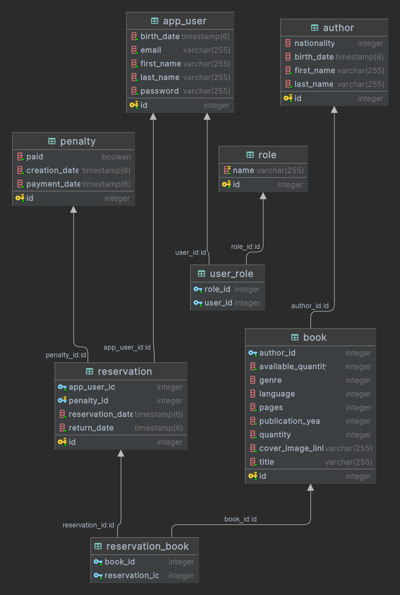

# Library Reservation System

This Spring Boot application provides a solution for managing a library's reservation system. It enables users to browse available books, reserve them, and manage their reservations. The system also allows library staff to manage books, users, and reservations through a secured interface.

## Features

- **User Registration and Authentication**: Secure user registration and login functionality.
- **Book Management**: Add, update, and delete books from the library catalog.
- **Reservation System**: Users can reserve available books and manage their reservations.
- **Role-based Access Control**: Different access levels for library staff and users.
- **Search Functionality**: Search for books by title, author, or genre.

## Technology Stack

- **Spring Boot 3.1.8** for creating the RESTful API.
- **Spring Security** for authentication and authorization.
- **Spring Data JPA** for database interactions.
- **JWT** for secure API authentication.
- **PostgreSQL** as the database.
- **Docker**: For database containerization.
- **Maven** for project management and build.

## Prerequisites

Before you begin, ensure you have met the following requirements:

- Java JDK 17 or newer.
- Docker.
- Gradle.

## Database Setup with Docker

This application uses PostgreSQL, running in a Docker container for database services. To start the PostgreSQL database:

1. Ensure Docker is installed and running on your machine.
2. Navigate to the directory containing the `docker-compose.yml` file.
3. Run the following command to start the PostgreSQL container:

    ```bash
    docker-compose up -d
    ```

This will start a PostgreSQL instance with the database `nnpia`, accessible on `localhost:5432` with username and password both set to `nnpia`.

## Database Scheme

The database schema is visualized in the following diagram:



## Configuration

Configure `application.yml` for your application to connect to the PostgreSQL database:

- **Database Connection**: Update `spring.datasource.url`, `spring.datasource.username`, and `spring.datasource.password` to match the Docker PostgreSQL configuration.

- **JWT Secret**: Set a secret key for JWT signing with `jwt.secret`.

1. **Clone** the repository to your machine.
2. **Navigate** to the project directory.
3. **Start the application** using the Gradle wrapper:

    ```bash
    ./gradlew bootRun
    ```

The service will start and be accessible at `http://localhost:8080`.


## Usage

With the application running, you can access various endpoints such as:
- `/api/v1/auth/register` for user registration.
- `/api/v1/auth/login` for user login.
- `/api/v1/books` to retrieve all books (authentication required).
- `/api/v1/books/{id}` to get details of a specific book by ID (authentication required).
- `/api/v1/reservations` to create or view reservations (authentication required).

## License

This project is open-sourced under the [MIT License](LICENSE).